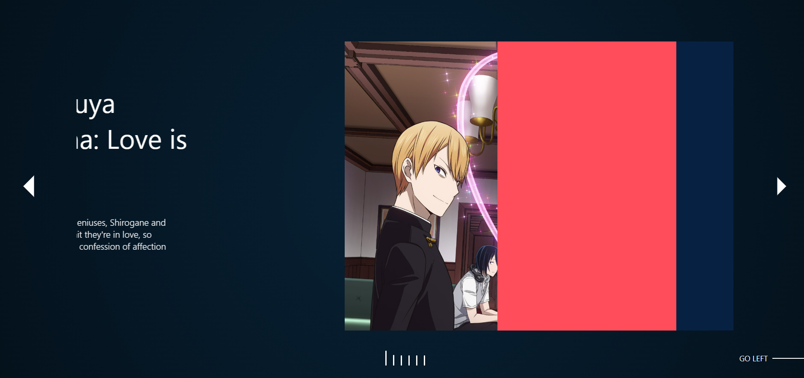

# react-animated-carousel-withDescription

- A full page animated carousel with description, changes color per slide and works with dark mode.

  
  
  Have a Look at the [Example](https://piyushchittora.github.io/npm-packages-demo/)

# Table of Contents

- [Getting Started🚀](#getting-started)
- [Customization🔥](#customization)
- [Examples👾](#examples)
- [Issues??🐛](#issues)

## Getting Started🚀

**`npm i react-3d-animated-carousel`**

```javascript
import {Carousel} from "3d-carousel-component";

const YourComponent = () => {
  return (
    <Carousel
      isDark={false}
      data={data}
    />
  );
};
```

## Customization🔥

- Basically you have to pass two props, Namely:
  - isDark
  - data
- Out of this, first is for styling the component for dark mode.
- Note all variables, props, properties follow UpperCamelCase Rule.\*

  ### isDark

  - It allows you to style component for dark mode.
  - Properties available are true or false.
  
  ### data
  
  - It bassically an array of objects with some mandatory or optional keys, 
  - Following properties are available: 😉

  | Key             | Function                                   |
  | :-------------- | :----------------------------------------- |
  | heading         | topic of the slide.                        |
  | description     | description of the slide.                  |
  | textOnly*       | true or false, if keyword is a link or not |
  | text            | highlighted text or button                 |
  | image           | carousel image                             |
  | color*          | color property for slide (optional)        |
  | link            | mandatory if textOnly: false(or missing)   |

  - Look at the example below for more understanding.

## Examples👾

```javascript
import {Carousel} from "3d-carousel-component";

import kaguya from "./assets/kaguya.jpg";
import opm from "./assets/opm.jpg";
import horimiya from "./assets/horimiya.jpg";
import DS from "./assets/demonslayer.jpg";
import mha from "./assets/mha.jpg";
import batman from "./assets/batman.jpg";

const YourComponent  =  ()  =>  {
	//List of element you want inside carousel.
	const content=[
    {
        heading:"Kaguya Sama: Love is war",
        description:"Two high school geniuses, Shirogane and Kaguya, can't admit they're in love, so each tries to win a confession of affection from the other.",
        textOnly:true,
        text:"This is text",
        image:kaguya
    },
    {
        heading:"One Punch Man",
        description:"The story of Saitama, a hero that does it just for fun & can defeat his enemies with a single punch.",
        text:"This is Link",
        image:opm,
        color:"#ffaf24",
        link:""
    },
    {
        heading:"Horimiya",
        description:"Two very different people - an academically successful schoolgirl and a quiet loser schoolboy - meet and develop a friendship.",
        text:"This is a link",
        image:horimiya,
        color:"#275BBF",
        link:""
    },
    {
        heading:"Demon Slayer",
        description:"The anime follows Tanjiro Kamado and his journey after his family's demise at the hands of the Demon King Muzan Kibutsuji.",
        text:"Again a link",
        image:DS,
        color:"#A020F0",
        link:""
    },
    {
        heading:"My Hero Academia",
        description:"Set in a world where superpowers (called Quirks) have become commonplace, the story follows Izuku Midoriya, a boy who was born without a Quirk but still ...",
        textOnly:true,
        text:"I love it and you should too.",
        image:mha,
        color:"#06b885",
    },
    {
        heading:"The Batman",
        description:"the superhero protector of Gotham City, a tortured, brooding vigilante dressed as a bat who fights against evil and strikes fear into the hearts.",
        text:"The moon is a loyal companion fr.",
        color:"#E33737",
        image:batman,
        textOnly:true,
    }
]

	return  <Carousel
			isDark={false}
      data={content}
		/>;
};

export defalut YourComponent;
```

## Issues??🐛

- Having any issues or found any bugs, feel free to reach me on github - [click here](https://github.com/piyushchittora/react-animated-carousel-withDescription/issues).📧

# Thank you